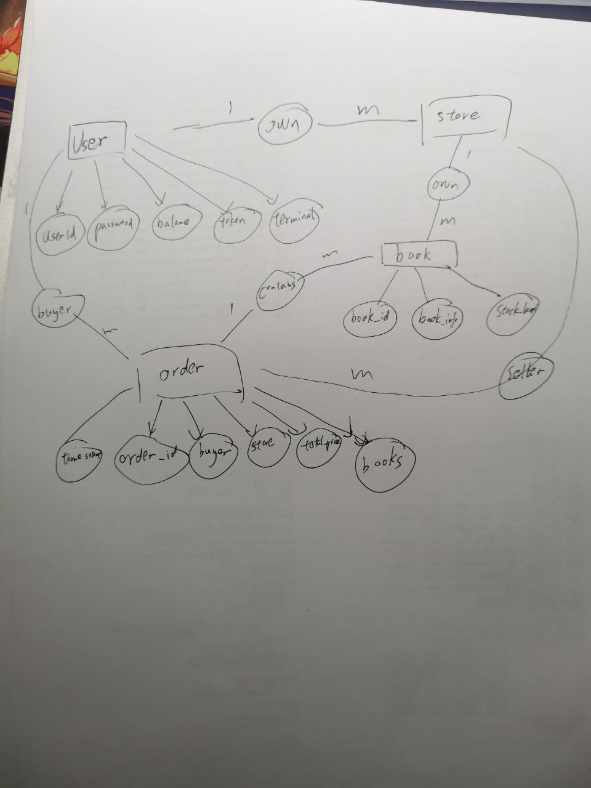

# Bookstore
The first bookstore homework with mongoDB is in this repository
[bookstore](https://github.com/SiriusNEO/SJTU-CS3952-Database-System)  
The second bookstore homework is built with PostgreSQL 
## Main Work
- Reconstruct backend code using ORM and PostgreSQL
- Design table structure using ER graph
- Examine the correctness and coverage 
## ER Graph

## sql 版本的表结构

##### Table User
- user_id PRIMARY FOREIGNKEY
- password
- balance
- token
- terminal

### Table Book
- store_id PRIMARY FOREIGNKEY
- book_id PRIMARY
- book_info
- stock_level

### Table UsertoStore
- user_id
- store_id PRIMARY

### Table Order
- order_id PRIMARY FOREIGNKEY
- buyer FOREIGNKEY
- store_id FOREIGNKEY
- state
- total_price
- timestamp

### Table OrdertoBooks
- order_id PRIMARY FOREIGNKEY
- book_id PRIMARY
- count
- price

## APIS
Same as homework1,see [bookstore](https://github.com/SiriusNEO/SJTU-CS3952-Database-System) for detail

## Coverage
